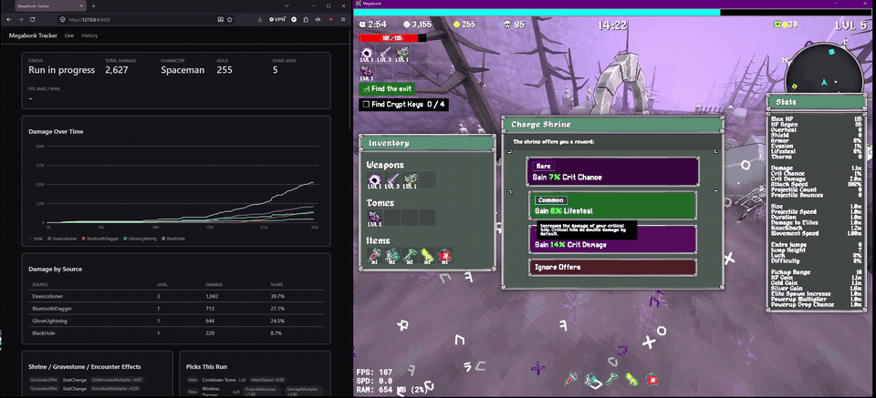
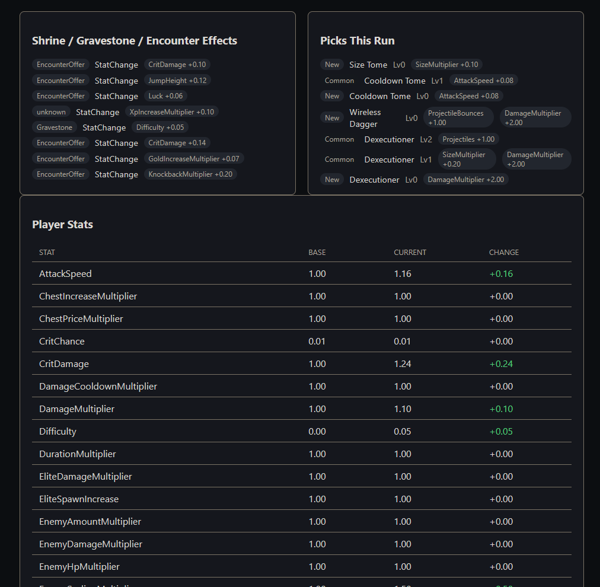
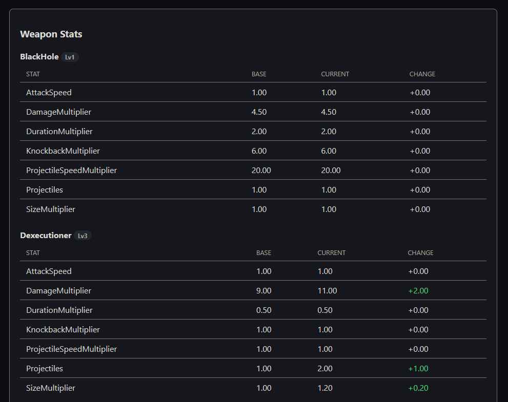
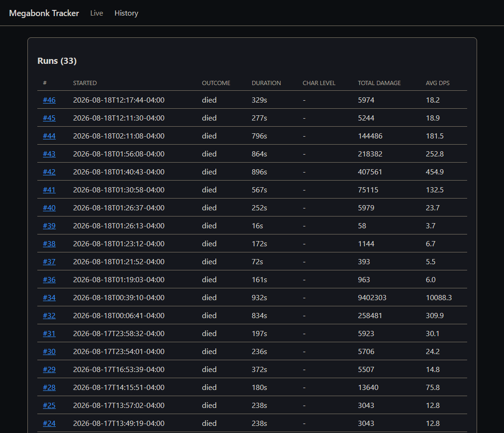

# Megabonk Tracker

A live damage and build tracker for [Megabonk](https://store.steampowered.com/app/3405340/Megabonk/), built to answer one question: how do you optimize a run's damage curve to accelerate it as much as possible? It tracks a run's damage output, item/tome/weapon picks, shrine and encounter buffs, and player/weapon stats, and keeps a local history so you can compare builds across runs. All of the data is pulled directly out of the running game — no external services or lookups involved.



## How it works

Megabonk is a Unity/IL2CPP game. This project has two parts:

- **`plugin/`** — a [BepInEx](https://docs.bepinex.dev/) IL2CPP plugin that hooks into the game process (via [Harmony](https://github.com/pardeike/Harmony) patches — full list under Notes below) and writes a stream of run events to a local newline-delimited JSON file.
- **`dashboard/`** — a local FastAPI + WebSocket web app that tails that file, shows a live view while you play, and persists every completed run to a local SQLite database for cross-run analysis (which items/tomes/combinations correlate with higher damage output).

Nothing here talks to the network. All data comes from the game's own in-memory state and stays on your machine.

**Live vs. end-of-run:** damage totals and run counters (gold, level, etc.) update every second while you play. Weapon and player stat breakdowns are captured once, right when the run ends — walking the game's full stat catalog every second turned out to cause a noticeable in-game stutter, and the build-analysis use case only needs the end-of-run numbers anyway.

## Setup

### Prerequisites

- Megabonk installed via Steam
- [BepInEx IL2CPP](https://builds.bepinex.dev/projects/bepinex_be) (bleeding-edge build) installed into the game folder — extract the `win-x64` IL2CPP zip into the Megabonk install directory so `BepInEx/core/BepInEx.Unity.IL2CPP.dll` exists
- [.NET 8 SDK](https://dotnet.microsoft.com/download) (to build the plugin)
- Python 3.10+ (to run the dashboard)

### Build and install the plugin

```
cd plugin
dotnet build -p:GameDir="C:\Path\To\Your\Megabonk"
```

The build automatically copies `MegabonkTracker.dll` into `BepInEx/plugins/MegabonkTracker/` in your game folder. Launch Megabonk once — BepInEx will load the plugin, and `BepInEx/LogOutput.log` should show `MegabonkTracker loaded.`

### Run the dashboard

```
cd dashboard
python -m venv .venv
.venv\Scripts\pip install -r requirements.txt
.venv\Scripts\python main.py
```

Open `http://127.0.0.1:8420` while a run is in progress for the live view, or `/history` for cross-run stats.

## What it tracks

- **Live damage over time** — total and per-weapon damage curves, polled once per second from the game's own `RunStats.damageSources`
- **DPS vs. enemy HP present** — total/average HP across every currently-spawned enemy, polled alongside damage, so the dashboard can show a live "damage dealt ÷ enemy HP present" ratio and its trend — a build whose ratio is falling is losing ground to enemy scaling in real time, before it dies
- **Picks** — every item/tome/weapon upgrade chosen at level-up, with the exact stat modifiers it applied and its rarity, plus the weapon/tome's max level cap
- **Shrine, gravestone, and encounter-reward effects** — buffs/debuffs from sources other than level-up picks, with the stat changed, amount, and whether it's permanent or timed (see caveat below — coverage isn't confirmed for every shrine type yet)
- **Moai / Shady Guy item grants** — these two shrine-adjacent sources hand out items directly instead of applying a stat effect, so they're tracked separately from the effects log above
- **Progression limits** — live weapon/tome level caps (base + any item-granted bonus), available/max weapon and tome slots, and whether the run has hit the concurrent-enemy cap or entered the endgame "Final Swarm" state (see `docs/game-limits.md`)
- **Weapon and player stats** — base stats vs. final effective stats, captured once at the end of the run, for both individual weapons and player-wide stats (crit chance, move speed, luck, etc. — the stats tomes and some items modify that aren't tied to one weapon). XP Gain is flagged once it exceeds the game's real (but otherwise invisible) 10x cap, so it's clear when further XP investment has stopped paying off
- **Run counters** — gold, character level, and banishes/refreshes/skips used, live throughout the run
- **Pause-aware timing** — the plugin detects the pause menu and stops emitting snapshots while paused; the dashboard excludes paused wall-clock time from the damage-over-time chart and from run duration/average DPS, so pausing to grab a coffee doesn't distort either
- **Cross-run history** — per-item pick rate and average DPS, plus pairwise/triple item-combination analysis to help spot synergies (each combo's sample size is shown, since small sample sizes aren't statistically meaningful). Runs that never reach character level 50 are treated as aborted attempts and aren't kept

<p>
  
  
</p>

The `/history` page lists every completed run with duration, outcome, and average DPS for quick cross-run comparison:



## Wiki reference

[`docs/wiki-reference/`](docs/wiki-reference/) is a point-in-time snapshot of the [Megabonk community wiki](https://megabonk.wiki/wiki/Main_Page) — characters, weapons, tomes, items, maps, quests, challenges, bosses, and patch notes — pulled in as a fact-check source when comparing builds, since there's no official mechanics documentation. It's fan-maintained and may lag behind the current game version or contain gaps; treat it as a hint, not ground truth, and trust this tracker's own live event data where the two disagree.

## Game limits and quiet mechanics

[`docs/game-limits.md`](docs/game-limits.md) documents every hard cap, ceiling, and undocumented mechanic found while using this tracker to optimize builds — weapon/tome level caps, the real (vs. displayed) XP Gain cap, the concurrent-enemy cap, the Final Swarm trigger, and mechanics the community wiki doesn't cover at all (Moai's item-grant shrine, the Shady Guy encounter, banish cooldowns). Each entry is marked by how it was confirmed — decompiled game source, this tracker's own run data, or wiki text taken on faith — so it's clear what's verified versus still an open question.

## Notes

This relies on reading the game's internal class structure via BepInEx's IL2CPP interop layer, decompiled from the installed game build. A Megabonk update that renames or restructures the classes this plugin hooks (`GameManager`, `UpgradePicker`, `RunStats`, `WeaponBase`, `PlayerInventory`, `EffectStat`, `PauseUi`, `EnemyManager`, `InventoryUtility`, `WeaponInventory`/`TomeInventory`, `InteractableShrineGreed`/`InteractableGravestone`/`InteractableShrineMoai`/`InteractableShadyGuy`, `EncounterOffer`, `AlwaysUi`) could break it until the plugin is updated to match.

Shrine/gravestone/encounter effects all route through one shared game class (`EffectStat.ApplyEffect`), confirmed working for encounter-reward screens. Coverage for every individual shrine type (Greed, Balance, Cursed, Magnet, Challenge) isn't fully verified yet — some may apply their effects a different way that this plugin doesn't currently catch. If a shrine's effect doesn't show up in the tracker, that's the likely reason. **Moai is a confirmed exception**: it grants an item directly rather than applying a stat effect, so it's tracked separately (see "Moai / Shady Guy item grants" above) and never appears in the effects log.
